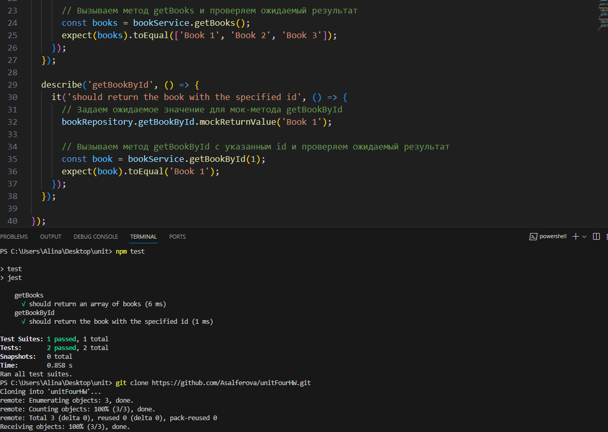

# unitFourHW

1. Задание сделано на языке js c использованием фреймворка jest.
2. В файле script.js - класс BookService, который использует интерфейс BookRepository для получения информации о книгах из базы данных.
3. В файле script.test.js - тесты с комментариями

Результат работы тестов
